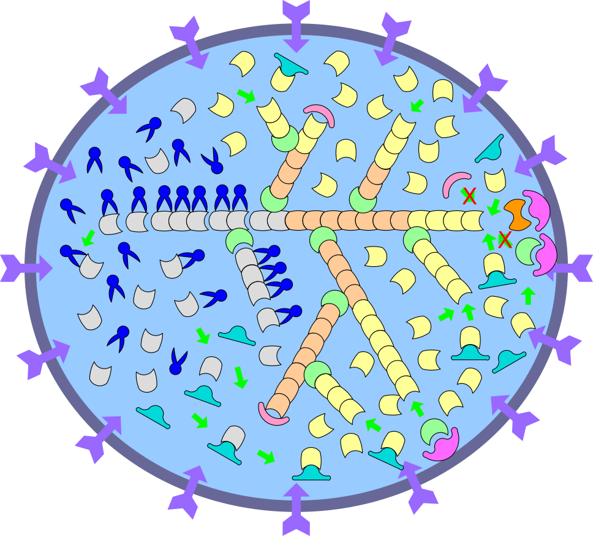
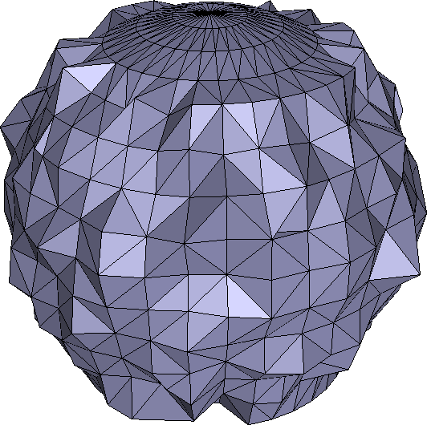

# Cell Motility Simulation

This is the source code of the computational program that I developed in my doctoral research to simulate the isotropic spreading process of a fibroblast cell triggered by extracellular fibronectin.

## Introduction

The computational model built in this research work uses three actin filament biochemical reactions to drive the reorganization of actin cytoskeleton inside cell, push cell membrane outward, and cause cell to spread isotropically.

The pictures below show a schematic view of actin filament dynamics inside a cell and an early phase of a simulated cell spreading process:

|                   Actin Filament Dynamics                    |                  Cell Spreading Simulation                   |
| :----------------------------------------------------------: | :----------------------------------------------------------: |
|  |  |

## Compiling Code

To compile the source code, GCC version 9+, Clang version 5+, and CMake version 3.8+ are needed with the following steps:

1.  **Creating Build Directory**

    Open a command-line terminal, change to the directory of the source tree, and issue the commands:

    ```shell
    mkdir build && cd build
    ```

2.  **Configuring CMake for Source Code**

    Use the command below to configure CMake's compilation options for the source code:

    ```shell
    cmake ..
    ```

3.  **Compiling Source Code**

    Compile the source code using CMake with the command:

    ```shell
    cmake --build .
    ```

When compilation finishes, an executable binary file `CellMotility` will be generated in the build directory.

## Running Simulation

To run the simulation, one needs to provide two parameter files in [the INI format](https://en.wikipedia.org/wiki/INI_file) to the `CellMotility` executable:

-   A parameter file `parameters.ini` that includes a set of parameters for cell geometry, molecular concentrations, cytoskeleton structure and other aspects of the simulation.
-   A reaction file `reactions.ini` that contains the definitions of a set of biochemical reactions with forward and backward rate constants.

**Note:** an example of both parameter files are included in the `input` directory in the source code directory.

Then one can launch the `CellMotility` executable with either of the following  two ways to start running the simulation:

### Option 1

Providing the two parameter files to the executable directly at the command line:

```shell
${BUILD_DIR}/CellMotility "${SRC_TREE}/input/parameters.ini" "${SRC_TREE}/input/reactions.ini"
```

where `${BUILD_DIR}` is the directory containing the `CellMotility` executable file.

Once the simulation starts, a series of output data files will be generated in the current directory where the `CellMotility` executable is invoked.

### Option 2

Setting up an environment variable `MOTILITY_HOME` to point to a directory that includes two sub-directories: `input` and `output`, such that the `input` directory contains the two parameter files for the simulation and the `output` directory will be used to host all the output date files generated during the simulation.

For example, one can set `MOTILITY_HOME` with the command:

```shell
export MOTILITY_HOME="${HOME}/Cell-Motility"
```

where the `${HOME}/Cell-Motility` directory contains an `input` and an `output` directories.

Then one can start the simulation using the command:

```shell
${BUILD_DIR}/CellMotility
```

**Note:** many parameters in the `parameters.ini` file can be fine tuned, especially the molecular concentrations in the `[molecule]` section.

Enjoy the simulation!
